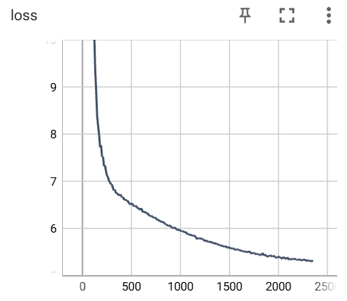
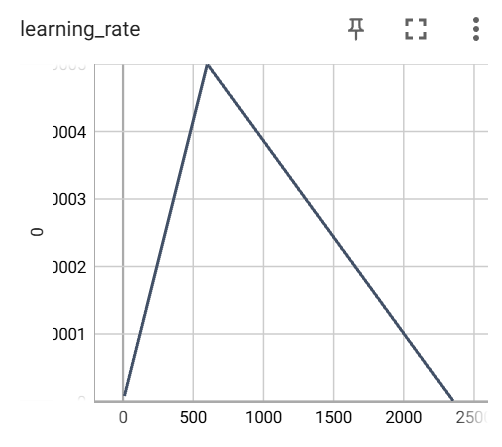

# 基于transfomer实现自动语音识别（ASR）

## 简介

**基于 Transformer 的最简 Seq2Seq 自动语音识别（ASR）实验**

仓库中包含：

* 训练与推理代码
* 模型检查点与日志
* 完整的训练与推理示例

**本项目将学习以下内容：**

* 从零搭建 Transformer 模型
* 将 Transformer 应用于语音识别
* 音频数据预处理与加载方法
* 基于子词的分词器构建与使用
* 基于贪心搜索与束搜索的推理方法

本仓库重点在教学与可读性，不包含复杂组件（如分布式训练、语言模型集成、CTC前缀束搜索等）。
若你想学习 ASR 基础原理，本项目是理想起点。

## 数据预处理

数据集使用 [miniLibriSpeech](https://www.openslr.org/31/) 的音频部分。

下载 LRS2 的训练和测试集，并准备以下文件：

* `./data/miniLibriSpeech/train.paths`：每行是音频文件路径
* `./data/miniLibriSpeech/train.text`：每行是对应文本
* `./data/miniLibriSpeech/train.lengths`：每行是音频时长（秒）

数据集下载之后运行程序prepare_minilibri.py文件，并根据自身情况修改路径，运行之后即可获得上述所示文件。

示例：

| train.paths | train.text       | train.lengths |
| ----------- | ---------------- | ------------- |
| 1.wav       | good morning     | 1.6           |
| 2.wav       | good afternoon   | 2.0           |
| 3.wav       | nice to meet you | 3.1           |


## 构建分词器

训练前需构建分词器。
本项目采用**子词级分词**（而非博文中的字符级）。
运行 `build_spm_tokenizer.sh`，修改参数 `save_prefix` 与 `txt_file_path`。
本项目已提供预训练分词器位于 `spm/miniLibriSpeech`。

## 训练

命令格式：

```bash
python train.py <feature_extractor_type>
```

支持两种特征提取器：

* `linear`
* `1D-ResNet18`（来自 [该实现](https://github.com/mpc001/Lipreading_using_Temporal_Convolutional_Networks)）

示例：

```bash
python train.py resnet
```

训练日志保存在 `logs` 文件夹。
因计算资源限制，这里只在小数据集上进行了训练，训练的效果如图所示：
   

## 推理

命令格式：

```bash
python test.py <feature_extractor_type> <checkpoint_path>
```

示例：

```bash
python test.py resnet .ckpts/checkpoints_resnet_miniLibriSpeech/model.safetensors
```


推理日志与预测结果保存在 `logs` 文件夹。

测试环境：

* Ubuntu 20.04.：Python 3.10.0, torch 2.5.1+cu124
